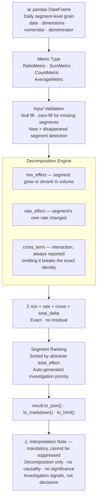

# MetricLens

**DataFrame-native metric movement decomposition for business analytics.**

MetricLens answers the most common question in product and business analytics: *a metric moved — where did it come from, and was it driven by mix shift, rate shift, or both?*

It is deterministic, DataFrame-native, dependency-light, and honest about what it cannot do.

[](https://pypi.org/project/metriclens/)
[](https://pypi.org/project/metriclens/)
[](LICENSE)
[](https://github.com/sidharthkriplani/metriclens/actions)

[](src/)
[](src/)
[](tests/)
[](src/)
[](https://pypi.org/project/metriclens/)

## How it works



---

## Why MetricLens exists

Every data team eventually builds the same one-off analysis: revenue dropped 14% — which segments drove it, and did they change in size or in performance? The answer requires decomposing the metric delta into segment contributions, mix effects, and rate effects. The math is standard. The implementation is not.

MetricLens packages that math as a pip-installable library with structured JSON, Markdown, and HTML output — so you stop writing the same decomposition from scratch and start getting consistent, auditable outputs.

---

## Install

```bash
pip install metriclens
```

For local development:

```bash
git clone https://github.com/sidharthkriplani/metriclens
cd metriclens
pip install -e ".[dev]"
pytest          # 19 tests, all pass
python examples/ecommerce_demo.py
```

---

## Quick start

```python
from metriclens import MetricLens, RatioMetric, SumMetric

lens = MetricLens(
    data=df,
    date_col="date",
    baseline_period=("2026-04-01", "2026-04-07"),
    current_period=("2026-04-08", "2026-04-14"),
    dimensions=["channel", "device", "city", "category"],
)

# Conversion rate: orders / sessions
result = lens.analyze(RatioMetric("orders", "sessions", name="cvr"))
result.to_json("outputs/cvr_rca.json")
result.to_markdown("outputs/cvr_rca.md")
result.to_html("outputs/cvr_rca.html")

# Revenue (additive)
result = lens.analyze(SumMetric("revenue"))
result.to_json("outputs/revenue_rca.json")
```

---

## Real output

The following is actual output from `examples/ecommerce_demo.py` on synthetic daily e-commerce data (756 rows, seed=42).

**Executive summary:**

```
CVR baseline : 0.0717  (7.17%)
CVR current  : 0.0635  (6.35%)
CVR delta    : -0.0082  (-11.4%)
Direction    : DOWN
```

**Segment contributions — channel dimension:**

| segment | baseline_rate | current_rate | mix_effect | rate_effect | cross_term | total_effect | contribution_pct |
|---|---|---|---|---|---|---|---|
| paid_search | 0.0730 | 0.0580 | 0.00375 | -0.00724 | -0.000771 | -0.00427 | 52.2% |
| organic | 0.0677 | 0.0668 | -0.00276 | -0.000325 | 0.0000358 | -0.00305 | 37.3% |
| email | 0.0774 | 0.0771 | -0.000819 | -0.0000386 | 0.00000275 | -0.000855 | 10.5% |

**Investigation areas (auto-generated):**

```
1. Investigate channel=paid_search first — largest absolute total_effect (-0.00427)
2. Investigate device=mobile first    — largest absolute total_effect (-0.00519)
3. Investigate city=Bengaluru first   — largest absolute total_effect (-0.00389)
4. Investigate category=skincare first — largest absolute total_effect (-0.00341)
```

**Interpretation note (always included in every output):**

> MetricLens reports deterministic metric movement decomposition. It identifies segment contributors,
> mix effects, rate effects, and cross terms. It does not claim causality, statistical significance,
> anomaly detection, or root cause proof. Use these outputs as investigation signals, not automatic decisions.

---

## How it works

### Additive decomposition (SumMetric, CountMetric)

For additive metrics like revenue or order count, each segment's contribution is:

```
segment_delta_s     = current_value_s − baseline_value_s
contribution_pct_s  = segment_delta_s / total_delta
```

All segment deltas sum exactly to `total_delta`. No residual.

### Mix / rate / cross decomposition (RatioMetric, AverageMetric)

For ratio metrics like conversion rate (orders / sessions), the population rate is:

```
R = Σ_s  w_s × r_s
```

where `w_s` is the denominator share of segment `s` and `r_s` is the per-segment rate.

The movement between baseline and current decomposes exactly:

```
w_c_s × r_c_s − w_b_s × r_b_s
  = (w_c_s − w_b_s) × r_b_s          ← mix_effect   (segment grew/shrank in volume)
  + w_b_s × (r_c_s − r_b_s)          ← rate_effect  (segment's own rate changed)
  + (w_c_s − w_b_s) × (r_c_s − r_b_s) ← cross_term  (interaction)
```

Summing `mix_effect + rate_effect + cross_term` across all segments equals `R_c − R_b` exactly (up to floating-point). The cross term is always reported — discarding it breaks the identity.

### Disappeared and new segments

MetricLens uses zero-fill convention: segments present in only one period get `w=0, r=0` in the other. For a disappeared segment the cross term is `(0 − w_b) × (0 − r_b) = +w_b × r_b` — positive, not zero. This is required for the identity to hold.

### Null dimension handling

Null dimension values are never dropped. MetricLens creates an internal working copy and replaces nulls with `"(null)"` so missing segment labels remain visible in the output. The original DataFrame is never modified.

### Edge cases handled

| Situation | Behaviour |
|---|---|
| `abs(total_delta) < 1e-9` (flat metric) | `direction = "FLAT"`, `contribution_pct = None` for all segments |
| `baseline_value == 0` | `relative_delta_pct = None` (percentage growth from zero is undefined) |
| Segment present in current only | `segment_status = "new"` |
| Segment present in baseline only | `segment_status = "disappeared"` |
| Null dimension values | Filled with `"(null)"` in working copy; original untouched |

---

## Metric types

| Type | Decomposition | Typical use |
|---|---|---|
| `SumMetric(column)` | Additive segment delta | Revenue, GMV, cost |
| `CountMetric(column=None)` | Additive row or non-null count | Orders, events, sessions |
| `RatioMetric(numerator, denominator)` | Mix / rate / cross | CVR, CTR, AOV via `revenue/orders` |
| `AverageMetric(value, weight=None)` | Mix / rate / cross (ratio-style) | Mean order value, weighted averages |

---

## API reference

### `MetricLens(data, date_col, baseline_period, current_period, dimensions)`

| Parameter | Type | Description |
|---|---|---|
| `data` | `pd.DataFrame` | Input DataFrame at daily segment-level grain |
| `date_col` | `str` | Name of the date column |
| `baseline_period` | `tuple[str, str]` | Inclusive start/end dates for baseline, e.g. `("2026-04-01", "2026-04-07")` |
| `current_period` | `tuple[str, str]` | Inclusive start/end dates for current period |
| `dimensions` | `list[str]` | Column names to decompose by (e.g. `["channel", "device"]`) |

### `lens.analyze(metric) → AnalysisResult`

Returns an `AnalysisResult` with:

| Method | Returns |
|---|---|
| `.to_json(path=None)` | JSON string; writes file if `path` given |
| `.to_markdown(path=None)` | Markdown string; writes file if `path` given |
| `.to_html(path=None)` | HTML string; writes file if `path` given |
| `.summary()` | `dict` with `baseline_value`, `current_value`, `absolute_delta`, `relative_delta_pct`, `direction` |
| `.segment_contributions()` | `pd.DataFrame` of all segment rows across all dimensions |
| `.to_dict()` | Full payload dict matching the JSON schema |

---

## Output schema (v0.1)

```json
{
  "schema_version": "0.1",
  "metadata": { "metric_name": "cvr", "decomposition_type": "ratio", ... },
  "executive_summary": {
    "baseline_value": 0.0717,
    "current_value": 0.0635,
    "absolute_delta": -0.0082,
    "relative_delta_pct": -11.4,
    "direction": "DOWN"
  },
  "quality_checks": [ { "check": "row_count_baseline", "status": "PASS", "detail": "..." } ],
  "dimensions": [
    {
      "dimension": "channel",
      "segment_contributions": [
        {
          "segment": "paid_search",
          "segment_status": "existing",
          "mix_effect": 0.00375,
          "rate_effect": -0.00724,
          "cross_term": -0.000771,
          "total_effect": -0.00427,
          "contribution_pct": 52.2
        }
      ]
    }
  ],
  "investigation_areas": [ "Investigate channel=paid_search first ..." ],
  "interpretation_note": "MetricLens reports deterministic metric movement decomposition ..."
}
```

---

## Data quality checks (auto-run)

Every `analyze()` call runs these checks automatically and includes results in the output:

| Check | What it detects |
|---|---|
| `row_count_baseline` / `row_count_current` | Empty periods |
| `date_coverage_baseline` / `date_coverage_current` | Missing dates within a period |
| `period_length_match` | Unequal baseline and current period lengths |
| `null_rate_{dimension}` | Null rates per dimension column |
| `duplicate_grain` | Duplicate rows at the full dimensional grain |

---

## What MetricLens is not

**Not causal inference.** A segment with a large contribution is an investigation priority, not a proven cause. Paid search driving 52% of a CVR drop means paid search is where you look next — not that paid search caused the drop.

**Not anomaly detection.** MetricLens does not compute z-scores, flag outliers, or compare against expected distributions.

**Not statistical significance testing.** There are no p-values, confidence intervals, or hypothesis tests. v1 will add bootstrap confidence intervals optionally.

**Not a BI dashboard.** MetricLens produces structured file outputs — JSON, Markdown, HTML. It does not run a server or render interactive charts.

**Not experiment infrastructure.** MetricLens does not run A/B tests, compute treatment effects, or replace an experimentation platform.

**Not an ML model.** There is no model, no training, no prediction. Decomposition is a deterministic algebraic identity.

---

## Roadmap

| Version | Scope |
|---|---|
| **v0.1.0** | Movement Mode: SumMetric, CountMetric, RatioMetric, AverageMetric, JSON/MD/HTML output ✅ |
| v0.2 | CLI (`metriclens analyze`), additional demo datasets |
| v1.0 | Shapley attribution across dimensions, bootstrap confidence intervals, optional LLM narrator |
| v2.0 | LiftMap Mode: segment opportunity ranking by benchmark-gap × volume |

---

## Contributing

See [CONTRIBUTING.md](CONTRIBUTING.md). Issues and PRs welcome.

---

## License

MIT © Sidharth Kriplani

---

## How This Connects

MetricLens provides the **"why did it move?"** layer for any of the decision platforms in this portfolio:

- **PulseRank:** After an A/B test changes the ranking algorithm, MetricLens decomposes GMV movement into seller mix shift (more high-GMV sellers exposed) vs. rate shift (same sellers converting at higher rates) — separating the diversity reranking effect from pure algorithm quality.
- **RiskFrame:** After a threshold policy change (v1.0 → v1.1), MetricLens quantifies how much of the approval rate change came from mix shift in the applicant pool vs. the threshold tightening itself.
- **MetaSignal:** Provides the post-experiment decomposition layer. MetaSignal answers "did the experiment win?" MetricLens answers "where in the segment distribution did the win come from?"

The library is intentionally standalone — no dependency on the other platforms. It can be dropped into any analytics pipeline that produces segment-level before/after DataFrames.
